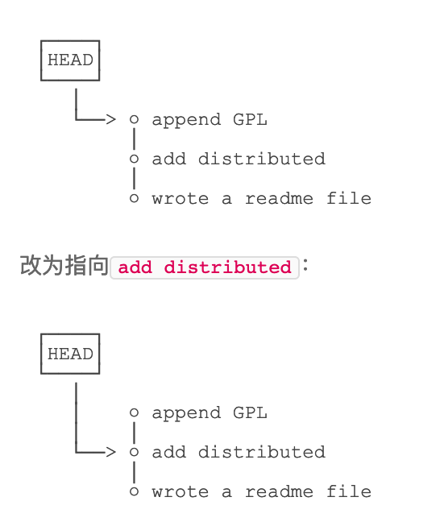

### Git command

git init # in the current folder and initialized the current folder as working directory

git log

git add ... && git commit -m '...'

git status

git diff

git reflog

git reset --hard HEAD^(HEAD-100; commit id)

